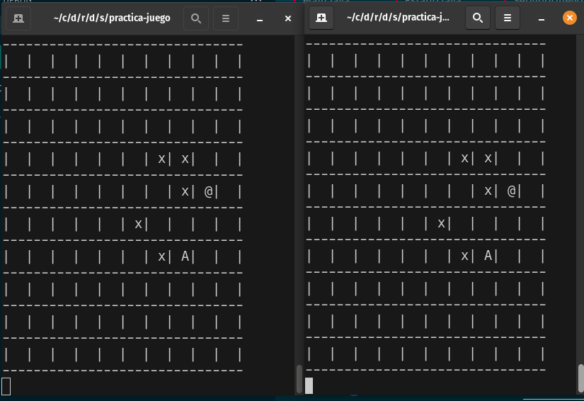

# Practica Sockets: Juego búsqueda del tesoro.

## Descripción

En esta práctica simulamos un juego online sencillo. Se trata de una búsqueda de tesoro en un tablero cuadriculado. Los jugadores, conectados mediante sockets, deben buscar y desenterrar un tesoro escondido en el tablero. Cada jugador se conecta a través de un cliente, y el servidor coordina las acciones de todos los jugadores, quienes interactúan mediante un protocolo de comandos sencillo.

### Estructura de Comunicación

- **Cliente -> Servidor:**
  - `MOVE UP|DOWN|LEFT|RIGHT`: mover al jugador en la dirección especificada.
  - `DIG`: intentar cavar en la ubicación actual.

- **Servidor -> Clientes:**
  - `PLAYER JOIN <PLAYER-ID> <X> <Y>`: notifica a todos los jugadores de la llegada de un nuevo jugador.
  - `MOVE <DIRECTION> <PLAYER-ID>`: notifica un movimiento de jugador.
  - `DIG <PLAYER-ID> <SUCCESS>`: notifica si un jugador ha encontrado el tesoro.

## Configuración de Clases

### Servidor

- `ServidorJuego`: maneja el estado del juego y coordina la conexión con múltiples clientes.
- `Estado`: mantiene el estado compartido, como la posición del tesoro, los jugadores y las posiciones ya cavadas.
- `ManagerCliente`: ejecuta en un hilo separado para manejar la comunicación con cada cliente, y coordina la actualización de su estado con el `Estado` global del servidor.

### Cliente

- `ClienteJuego`: se conecta al servidor, envía comandos basados en la entrada del usuario y actualiza el estado del juego según los mensajes del servidor.
- `Estado`: representa el estado del cliente, incluyendo la ubicación de los jugadores y los puntos ya buscados.

## Ejecución de la Práctica

### Preparación

Asegúrate de completar las tareas pendientes (marcadas como `TODO`) en las clases `Estado`, `ClienteJuego`, `ServidorJuego` y `ManagerCliente`. Algunos de estos `TODO` incluyen:

1. **Servidor**:
   - Crear conexiones cliente usando `ServerSocket`.
   - Implementar un sistema de transmisión (`broadcast`) para enviar mensajes a todos los clientes conectados.
  
2. **Cliente**:
   - Iniciar la conexión al servidor y procesar los mensajes recibidos.
   - Implementar la entrada de usuario con comandos como `WASD` para moverse y `Q` para buscar.
   
3. **ManagerCliente**:
   - Mantener la comunicación activa con el cliente y actualizar el estado del servidor en función de los comandos recibidos.

### Ejecución de Pruebas

La suite de pruebas `AppTest` valida las funcionalidades principales del sistema. Incluye pruebas para:

- **Conexión**: valida que un cliente puede conectarse correctamente al servidor.
- **Movimiento**: verifica que el movimiento de un jugador se propaga correctamente.
- **Excavación (DIG)**: asegura que el intento de excavar se refleja en el estado de los clientes.
- **Finalización**: comprueba que el juego termina cuando un jugador encuentra el tesoro.

## Ejecucion

Se incluye una clase Main para ejecutar esto fuera de los tests.

Primero empaquetamos ...

```
mvn package
```

Y luego iniciamos el servidor

```
java -jar target/sockets-1.0-SNAPSHOT.jar servidor 12345
```

Ahora en otras terminales podemos iniciar varios clientes

```
java -jar target/sockets-1.0-SNAPSHOT.jar cliente localhost 12345
```

El resultado es que lo que hagamos en una terminal se replicara en la otra,
y podemos tener una interfaz tal que asi.



(Esto se podria ejecutar en varias máquinas de la misma red sin problema.)

# Objetivos Extra:

- Usar logging.
- Extender el juego con algun otro 'comando'